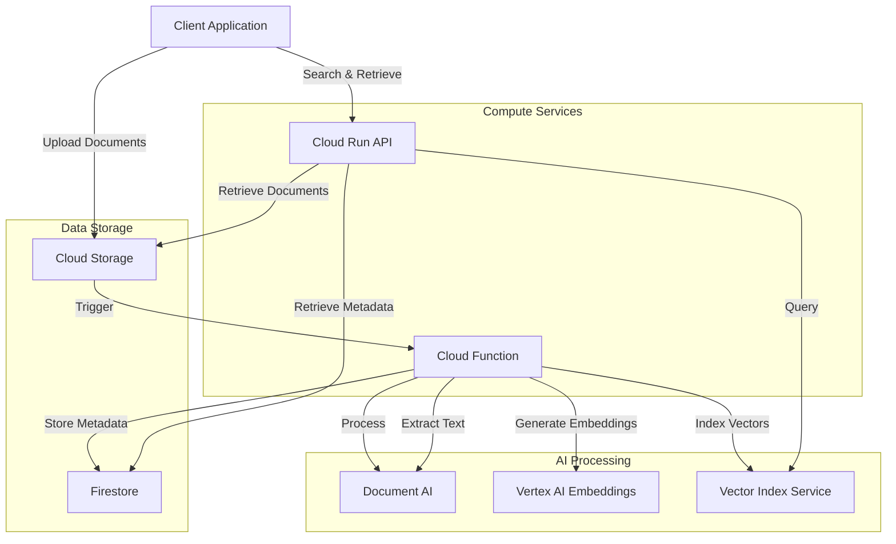

# Technical Document Management System

This repository contains the OpenTofu infrastructure code to deploy a technical document management system on Google Cloud. The system leverages various Google Cloud services to provide document processing, analysis, search, and retrieval capabilities.

## Infrastructure Design

The infrastructure is designed to support a comprehensive document management workflow:

1. **Document Ingestion**: Documents are uploaded to Cloud Storage, triggering processing workflows.
2. **Document Processing**: Cloud Functions process the documents using Document AI for OCR and text extraction.
3. **Vector Indexing**: Documents are embedded using Vertex AI models and stored in both text and visual Vertex AI Vector Search indices.
4. **Search and Retrieval**: A Cloud Run API service provides interfaces for document search and retrieval.
5. **Metadata Storage**: Document metadata is stored in Firestore for efficient retrieval.

## Architecture Diagram



## Components

### Google Cloud Services

1. **Cloud Storage**
   - Document storage bucket: Stores the original and processed documents
   - Processing bucket: Temporary storage for processing documents
   - Function bucket: Stores Cloud Function code

2. **Document AI**
   - OCR Processor: Extracts text and structure from documents

3. **Vertex AI**
   - Text Vector Index: For text-based searching of documents (768 dimensions)
   - Visual Vector Index: For visual element searching in documents (512 dimensions)
   - Text Embedding Model: textembedding-gecko
   - Multimodal Embedding Model: multimodalembedding

4. **Discovery Engine**
   - Document Datastore: Provides advanced search capabilities for technical documents

5. **Firestore**
   - Document Metadata: Stores document metadata and relationships in Firestore Native database

6. **Cloud Functions**
   - Document Processor: Triggered when documents are uploaded to Cloud Storage for processing

7. **Cloud Run**
   - API Service: Provides RESTful API for interacting with the document management system

8. **Artifact Registry**
   - Document API Repository: Stores container images for the Cloud Run API service

## Deployment

### Prerequisites

- Google Cloud account with billing enabled
- Google Cloud project
- OpenTofu installed locally
- Service account with necessary permissions

### Setup

1. Run the initialization script to create a service account with the necessary permissions:

```bash
./init.sh [PROJECT_ID]
```

2. Configure OpenTofu variables:

```bash
cp terraform.tfvars.example tofu.tfvars
# Edit tofu.tfvars to set your project ID, region, and other settings
```

3. Initialize OpenTofu and authenticate with the service account:

```bash
export GOOGLE_APPLICATION_CREDENTIALS="./tofu-key.json"
tofu init
```

4. Deploy the infrastructure:

```bash
tofu plan
tofu apply
```

5. After successful deployment, run the post-initialization script to finalize setup (if needed):

```bash
./post-init.sh
```

## Usage

Once deployed, you can:

1. Upload documents to the document storage bucket
2. Documents will be automatically processed and indexed
3. Use the API endpoint (output after deployment) to search and retrieve documents

## Security Considerations

- Cloud Run service is publicly accessible by design but can be secured with IAM or API Gateway
- All other resources have strict IAM permissions
- Storage buckets are configured with uniform bucket-level access
- Consider implementing additional access controls and VPC Service Controls for production use

## Scaling

This infrastructure is designed to scale with your needs:

- Cloud Functions auto-scale based on document upload volume
- Cloud Run auto-scales based on API request volume (configured with CPU and memory limits)
- Vector indices are optimized with appropriate dimensions and approximate nearest neighbor settings
- Storage buckets include lifecycle rules to manage document retention

## Regions and Locations

- Most resources are deployed in the configured region (default: eu-west1)
- Document AI processors are deployed in the EU region due to service availability
- Firestore is configured in a multi-regional location (eur3) for higher availability
- Discovery Engine is deployed globally

## Management and Monitoring

- Use Google Cloud Console to monitor resource usage and performance
- Check Cloud Logging for function and service logs
- Monitor document processing status through the API
- The infrastructure includes appropriate IAM roles for secure management

## CI/CD with Cloud Build

This project uses Google Cloud Build for continuous integration and deployment:

1. **Build Triggers**: 
   - Main branch trigger: Automatically builds and deploys changes to the main branch
   - PR validation trigger: Runs tests on pull requests before merging

2. **Build Process**:
   - Runs automated tests using Python 3.9
   - Builds Docker container images for the document API
   - Pushes images to Artifact Registry with versioned tags
   - Deploys updated services to Cloud Run
   - Packages and uploads Cloud Function source code

3. **Setting Up CI/CD**:
   ```bash
   # The deployment includes GitHub repository connection
   # To manually trigger a build:
   gcloud builds submit --config=cloudbuild.yaml --substitutions=_REGION=eu-west1
   ```

4. **Monitoring Builds**:
   - View build history and logs in Google Cloud Console
   - Set up build notifications for failed or succeeded builds
